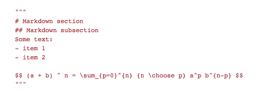
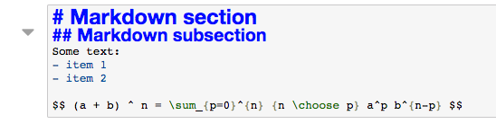
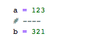
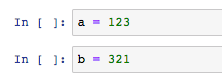
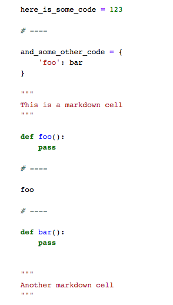
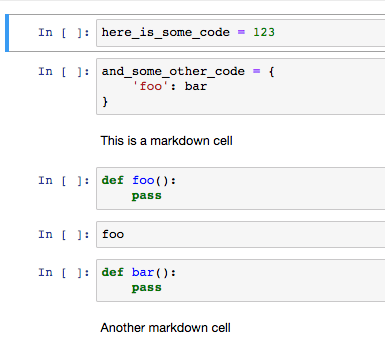
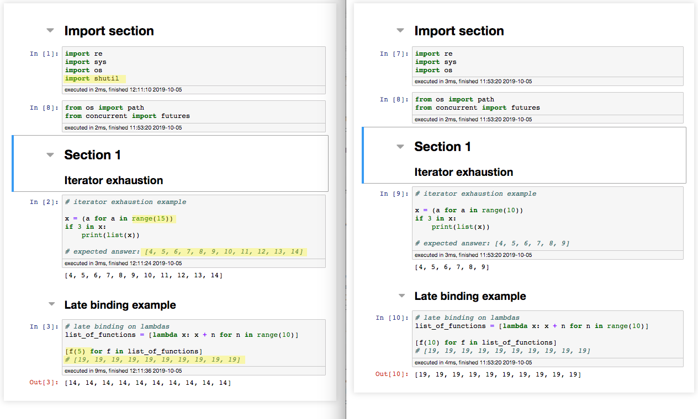
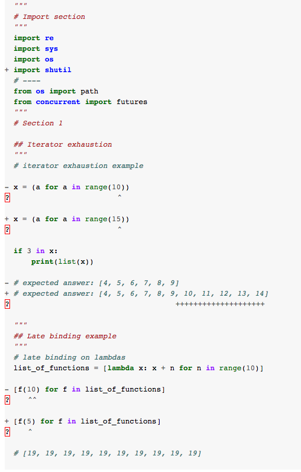
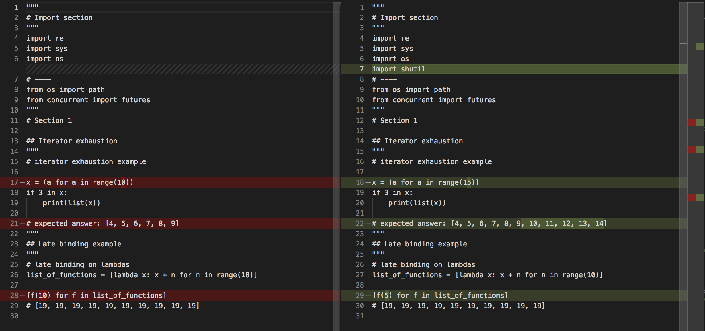

# `nbtemplate`

This packages provides simple converters from python code to jupyter notebooks and back. The two main use cases for this
are:

- Provide a mechanism to programmatically generate notebooks based on a python file. Storing the notebook template 
as a python file has several obvious advantages:

    - Version control: version control is much simpler as it is easier to show differences between two python files than 
    between two notebooks
    - Code inspection: storing the code of a notebook in a python file allows to run code inspection from your favorite
    IDE to analyze the notebook's code.
    
- Allow easy comparison of the code within two notebooks by comparing their code representation. Transferring code from 
one notebook to another based on a comparison is hard and requires copying/pasting code, cell by cell. This allows to 
run the diff program against the python files representing the notebooks, transfer code and regenerate the notebooks

## What this module *does not* do
This module only considers the code in notebook, meaning any transformation will discard the output and other metadata 
associated to the running of the notebook. It only keeps the code/markdown cells and their structure. Running this code 
to transfer code and regenerate the notebook will lead to a plain, never-run notebook. 


## Format
The conversion to and from notebooks relies on a few mappings:

WARNING: This package is still pre-alpha and the test coverage is still very spotty. There is always a risk of lost data between 
notebook and code. Make backup copies.


### Markdown cells

Markdown cells in a notebook are represented as triple-quoted-strings in the code:

|    Code                |   Notebook cell
|-------------------------------:|:-------------------------
| | 


### Separation between cells
To introduce a separation between two different bits of code, use
```python
# ----
```
as follows 

| Code | Notebook cell 
|---------------------------------:|:---------------------------
||     

 

### Code cell

Code cells are defined as the code between every other markers. Here's a full example

|     Code                        |   Notebook cell
|-------------------------------|-------------------------
|     | 


# Examples

## Notebook comparison
Here are two notebooks (in `resource/example{1,2}.py`) with slightly different code (highlighted in yellow):


To compare them, run the following (note that the comparison relies on external modules that must be installed):
```python
import os
from nbtranslate import core
core.compare_notebooks_code(
    os.path.join(path_to_repo, 'resources/example1.ipynb'), 
    os.path.join(path_to_repo, 'resources/example2.ipynb'), 
    typ='ndiff'
)
```


Note that all three modes of comparison available in `difflib` (`unified_diff`, `context_diff`, `ndiff`) are available.

When using with an external comparison software:
```python
import os
from nbtranslate import core
core.compare_notebooks_code(
    os.path.join(path_to_repo, 'resources/example1.ipynb'), 
    os.path.join(path_to_repo, 'resources/example2.ipynb'), 
    external_diff_command='/Applications/Visual Studio Code.app/Contents/MacOS/Electron',
    external_diff_args=['--diff']
)
```



# Todo
- The handling of the external program and cleaning up of the temporary files where the code of the notebooks is stored
is still clunky. One solution would be to watch the temporary files in a thread and remove them as soon as the handle is
released

- Add support for magic cells?
